# OpenAPI

Curso Udemy de introducción a OpenAPI: `https://www.udemy.com/course/openapi-beginner-to-guru`

## Overview of OpenAPI

OpenAPI es un standard adoptado para describir APIs, tecnológicamente agnóstico, es decir, se pueden beneficiar de él programadores Java, .NET, PHP...

La especificación OpenAPI se define usando `YAML` o `JSON` y está respaldada por un esquema formal, que define las propiedades del documento y sus tipos de datos.

Debido a que OpenAPI es un documento estructurado, puede leerse programáticamente. También hay muchas herramientas para trabajar con él, como convertidores, validadores, editores GUI, servicios Mock, Generadores SDK...

Por ejemplo, podemos llevarnos una especificación API directamente a Postman y obtener su funcionalidad.

También existe `OpenAPI CodeGen` para generar código del lado del servidor para más de 20 lenguajes, y código del lado del cliente para más de 40 lenguajes.

Usando una especificación OpenAPI, esta se convierte en la única fuente de la verdad de la que la API se supone que hace. Si el código fuente implementa esta especificación, se puede asumir que es correcto.

**Pet Clinic on Swagger Editor**

`https://editor.swagger.io/`

Las diferentes secciones de una especificación OpenAPI se consideran objetos.

En el ejemplo de la imagen, info es el objeto y title, description... son propiedades del objeto.

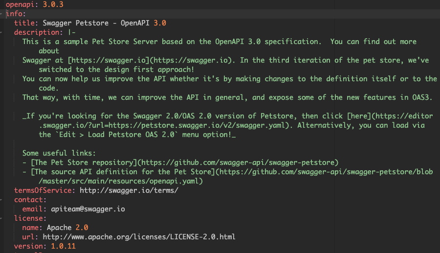

También existen objetos de operaciones, como muestra esta imagen.

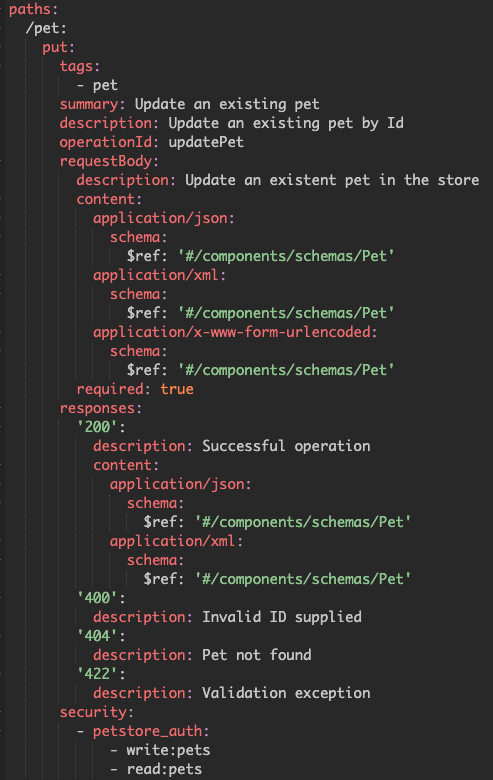

Podemos ver en dicha imagen que es una operación PUT con request body y su response.

**OpenAPI 2.0 vs 3.0**

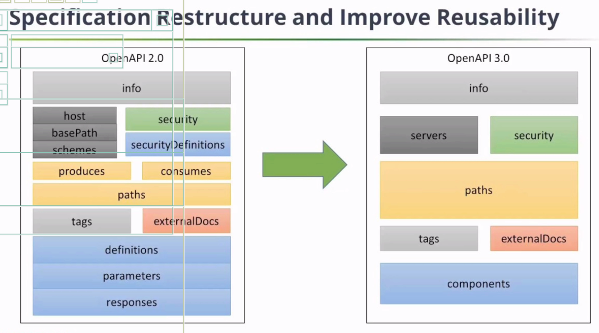

Este curso esta orientado a OpenAPI 3.0, que es donde la industria se está dirigiendo.

Cada una de las cajas se corresponde con un objeto definido en el esquema OpenAPI.

**YAML**

Sintaxis de YAML: `https://learnxinyminutes.com/docs/yaml/`

En este curso vamos a usar YAML para definir nuestras especificaciones OpenAPI (también se puede usar JSON)

## Defining a Microservice with OpenAPI

Vamos a ver los componentes principales e iremos paso a paso desarrollando nuestra especificación OpenAPI.

En este punto vamos a ver todo a un nivel muy superficial.

**Swagger Hub**

`https://swagger.io/tools/swaggerhub/`

Voy a usar el editor web de Swagger Hub para crear las especificaciones OpenAPI.

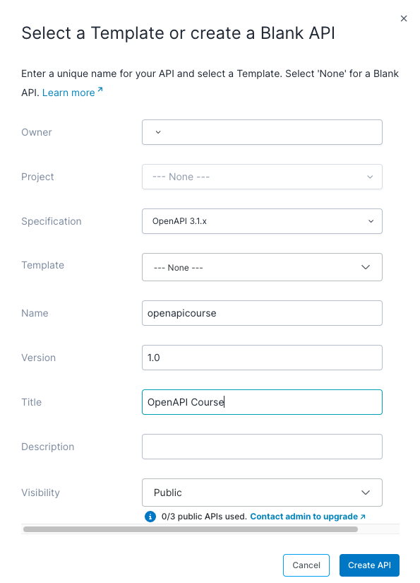

Una vez pulsado el botón para crear la API, vemos la pantalla del editor y su conversión gráfica Swagger al lado.

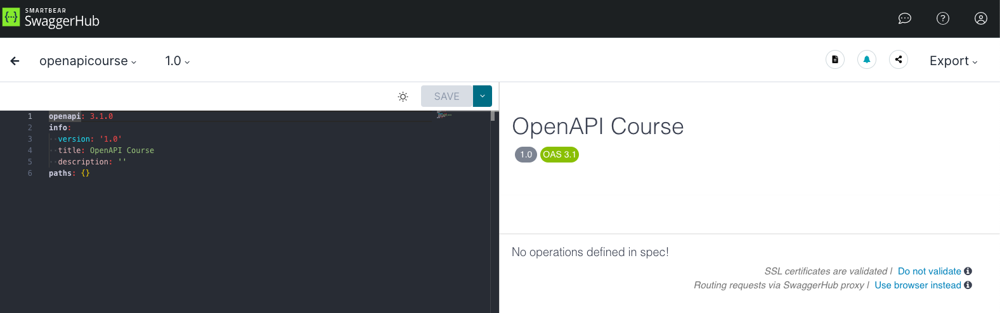

**OpenAPI Specification**

Github con el código fuente de la especificación OpenAPI: `https://github.com/OAI/OpenAPI-Specification`

Esquema para la versión 3.1: `https://github.com/OAI/OpenAPI-Specification/blob/main/schemas/v3.1/schema.yaml`

Herramientas para distintos lenguajes de programación: `https://tools.openapis.org/`

Para VSCode existe el plugin `OpenAPI (Swagger) Editor` aquí: `https://marketplace.visualstudio.com/items?itemName=42Crunch.vscode-openapi`

**OpenAPI Info Object**

Ver: `https://swagger.io/specification/` en concreto ir a `OpenAPI Object`.

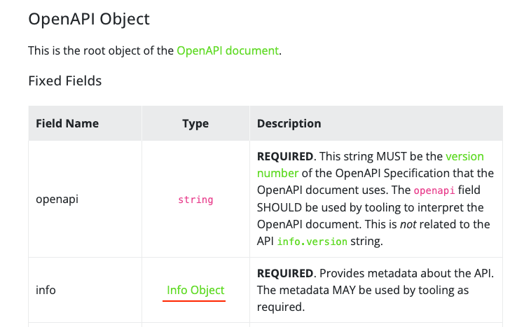

Vemos que para definir una especificación OpenAPI válida, como mínimo hay que definir las propiedades `openapi`, `info` y `paths`.

Las propiedades que podemos definir para el objeto `info` son:

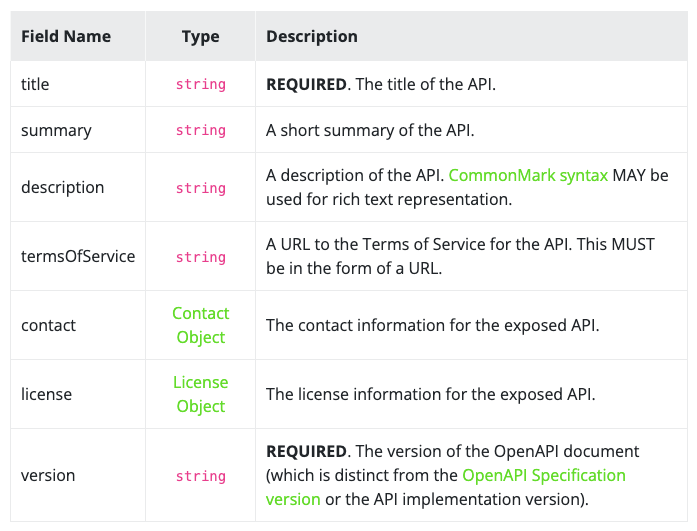

Siendo `title` y `version` obligatorias.

**OpenAPI Servers Object**

Los `servers` son un objeto opcional, por lo que no tenemos que especificarla. Es una forma de dar a los usuarios finales información sobre donde está disponible la API.

Ver: `https://swagger.io/specification/` en concreto ir a `Server Object`.

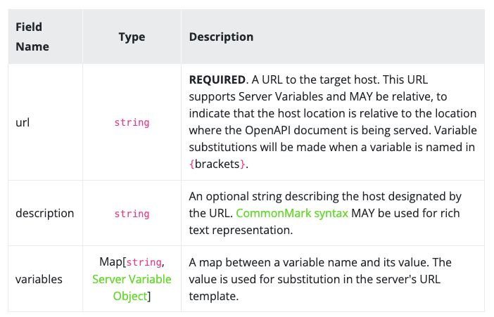

Si decidimos especificar el objeto `servers`, vemos que solo es obligatorio informar la propiedad `url`.

**OpenAPI Paths Object**

Los `paths` son un objeto requerido, pero puede aparecer como un array vacío:

```
paths: {}
```

Es la ruta de la API.

Ver: `https://swagger.io/specification/` en concreto ir a `Paths Object`.

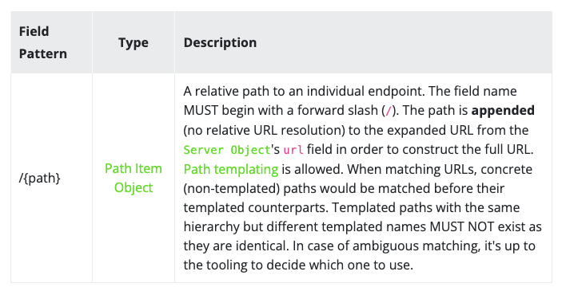

Y las propiedades posibles de cada item object del array son:

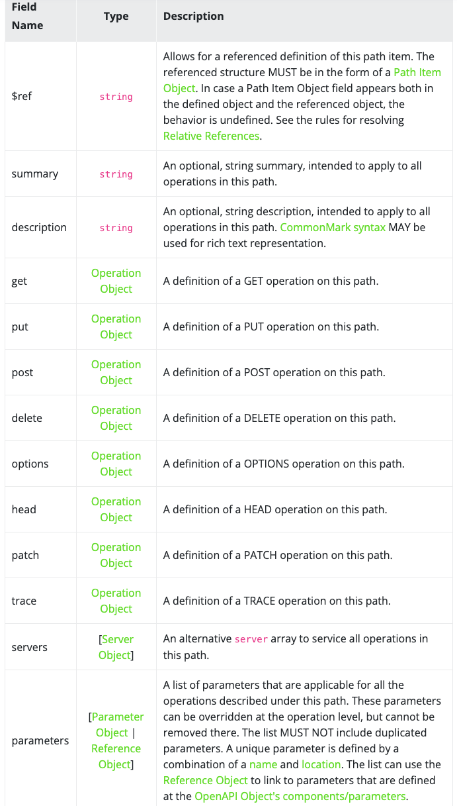

Que a su vez se ramifican en más objetos con sus propiedades. Ver por ejemplo `Operation Object`.

## OpenAPI Schema

Cuando estamos proporcionando información a una API o recibiendo información de vuelta, normalmente tenemos objetos fuertemente tipados que vamos a transferir de un lado a otro. Esto se hace frecuentemente usando un esquema JSON.

Un esquema se basa en metadata sobre datos. Esto es lo que va a especificar la API, lo que la API espera cuando le das datos y lo que puedes esperar recibir de vuelta. Es decir, nombres de propiedades, tipos y descripciones completas de objetos.

En esta sección vamos a empezar a explorar las capacidades del esquema OpenAPI, que sigue de cerca el esquema JSON, y vamos a ver como podemos definir tipos de datos ricos para nuestros componentes OpenAPI y a proporcionar estructuras de datos.

**JSON Schema**

Vamos a hablar un poco sobre los esquemas JSON, pero no se usan en el curso.

Documentación: `https://json-schema.org/understanding-json-schema`

El esquema JSON es una herramienta para especificar la estructura de datos JSON y OpenAPI, el cual utiliza JSON o YAML.

Por ejemplo, en esta web vemos el esquema JSON de un string: `https://json-schema.org/understanding-json-schema/reference/string`

Parte de la especificación OpenAPI está vinculada a la definición de tipos de datos. Cuando enviamos un objeto JSON al servidor, OpenAPI le va a dar características de esquema JSON para especificar el objeto que se desea hacer post.

Incluso si recibimos un objeto XML desde nuestra API, OpenAPI va a utilizar el esquema JSON, por lo que podemos decir que se basa en gran medida en el esquema JSON.

No vamos a utilizar directamente el esquema JSON, pero tenemos que quedarnos con que OpenAPI hereda (no al 100%) y extiende el esquema JSON.

**OpenAPI Data Types**

Vamos a hablar sobre los tipos de datos de las propiedades de objetos, excluidos los mismos objetos, de OpenAPI.

Documentación: 

```
https://swagger.io/docs/specification/v3_0/data-models/data-types/
https://swagger.io/specification/#schema-object
```

En la tabla que vemos en la documentación, indicar que la propiedad `format` es específico de la aplicación. Pero también es una propiedad abierta, lo que significa que se puede extender para utilizar propiedades que no están en la tabla, como email, uuid, url... La especificación no impone restricciones, lo que da mucha flexibilidad.

Esto permite ampliar la especificación si se utiliza algún tipo de herramienta para generar código o documentación.

**OpenAPI Objects**

Vamos a ver como crear objetos y definirlos dentro de esquema OpenAPI.

Para ello, ver `02-OpenAPI-Schema`, la parte referida a los `properties` dentro de `items`.

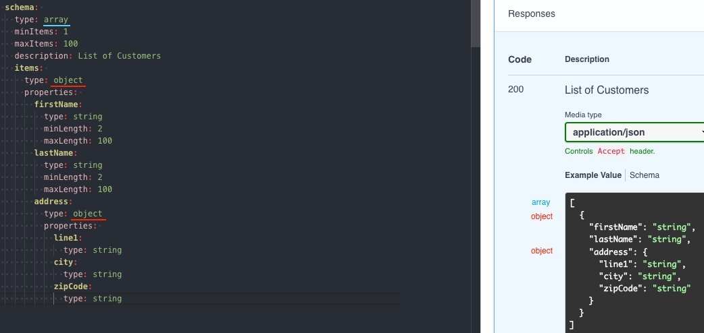

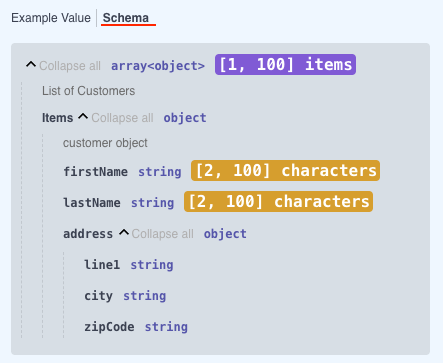

**OpenAPI Enums**

Vemos una herramienta muy poderosa de OpenAPI, las enumeraciones. Se usan cuando se tiene un conjunto limitado de valores.

Las enumeraciones se pueden indicar de dos formas distintas.

Una es usando una lista con los valores posibles:

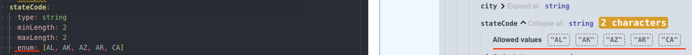

La otra es indicando cada valor posible. Esta sintaxis es más del tipo YAML:

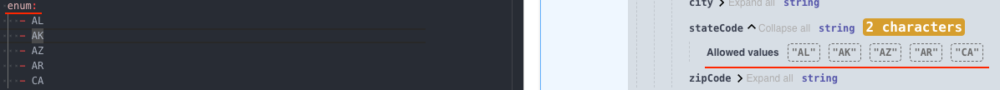

## OpenAPI Components

En esta sección veremos el uso de los componentes OpenAPI.

La idea es poder reutilizar objetos de esquema y los componentes OpenAPI son una manera de poder estandarizar su uso.

Nos ahorra mucho tiempo en la codificación y contribuye a la calidad de la especificación.

Ver `03-OpenAPI-Components`.

**OpenAPI Components Object**

Vemos el objeto Components de OpenAPI.

Documentación: `https://swagger.io/specification/#schema-object` y buscar `Components Object`.

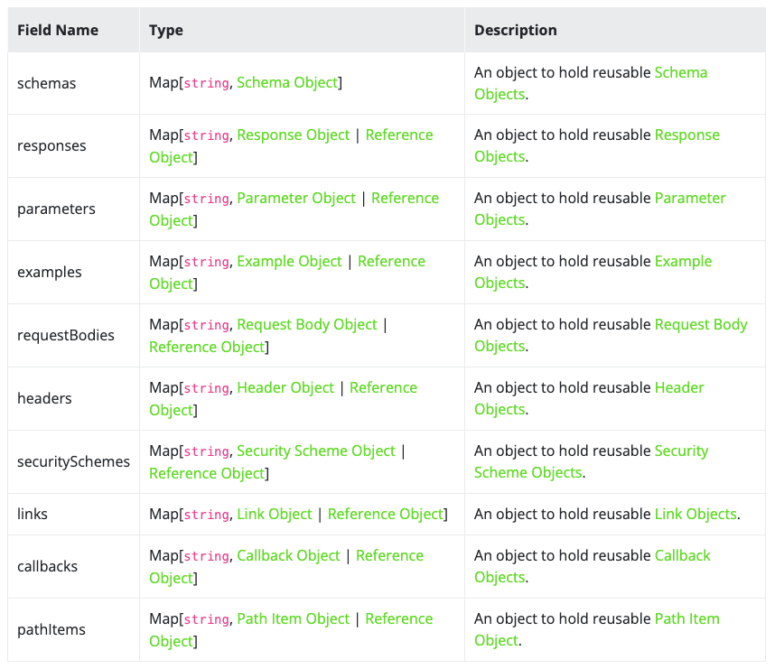

Su objetivo es contener objetos comunes del esquema. Por ejemplo, si tenemos varios endpoints que trabajan con un objeto, en el objeto Components podemos definirlo y reutilizarlo.

Para reutilizarlo se utiliza un objeto Reference, es decir, en el lugar donde especificaríamos el esquema, informaremos una propiedad `$ref: #/components/schema/recurso`, donde `recurso` será un objeto de esquema o un objeto de referencia.

Documentación: `https://swagger.io/specification/#reference-object`

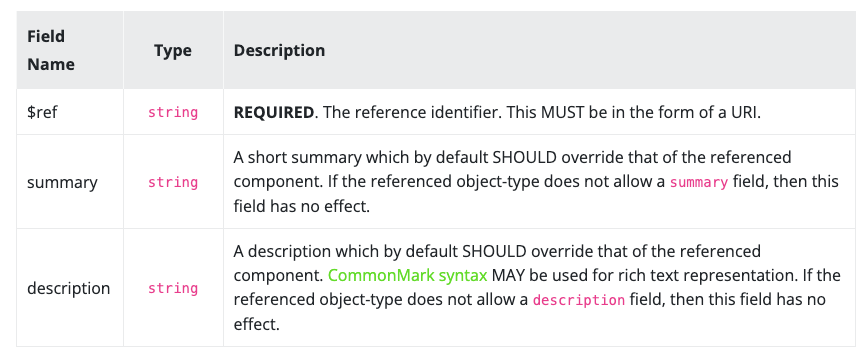

Hay realmente tres formas de definir un objeto de referencia:

```
$ref: '#/components/schemas/Pet'

Relative Schema Document Example
$ref: Pet.yaml

Relative Documents With Embedded Schema Example
$ref: definitions.yaml#/Pet
```

**Creating Reusable Customer Object**

Ver `03-OpenAPI-Components`.

Este es un ejemplo de uso:

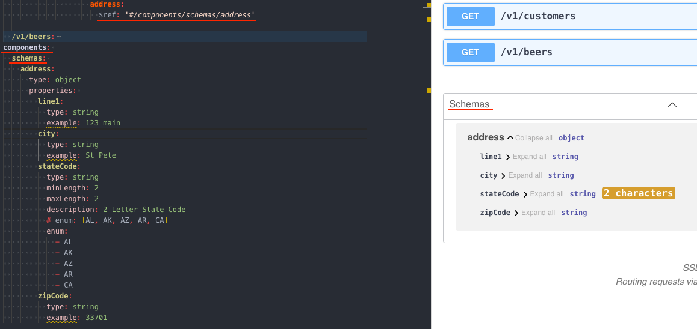

**OpenAPI Object Inheritance**

Nos permite heredar propiedades de un objeto diferente.

Ver `03-OpenAPI-Components`, la parte `pagedResponse` y `beerPagedList`.

Vemos como se usa la propiedad `allOf` para obtener herencia.

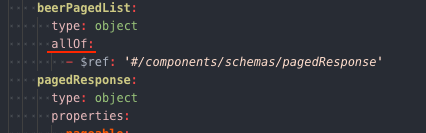

Y en este ejemplo, decimos además que el contenido es un array de artículos de cerveza.


