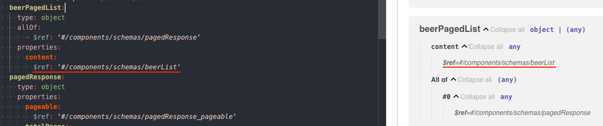
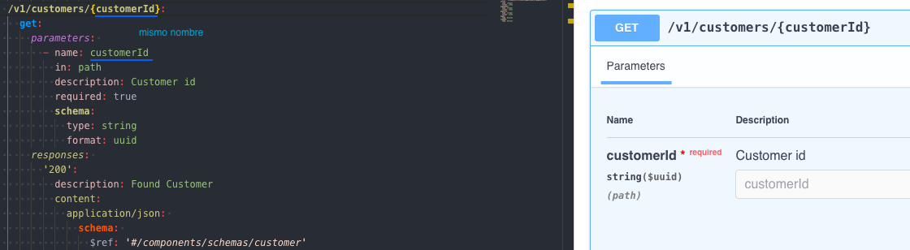

# OpenAPI

Curso Udemy de introducción a OpenAPI: `https://www.udemy.com/course/openapi-beginner-to-guru`

## Overview of OpenAPI

OpenAPI es un standard adoptado para describir APIs, tecnológicamente agnóstico, es decir, se pueden beneficiar de él programadores Java, .NET, PHP...

La especificación OpenAPI se define usando `YAML` o `JSON` y está respaldada por un esquema formal, que define las propiedades del documento y sus tipos de datos.

Debido a que OpenAPI es un documento estructurado, puede leerse programáticamente. También hay muchas herramientas para trabajar con él, como convertidores, validadores, editores GUI, servicios Mock, Generadores SDK...

Por ejemplo, podemos llevarnos una especificación API directamente a Postman y obtener su funcionalidad.

También existe `OpenAPI CodeGen` para generar código del lado del servidor para más de 20 lenguajes, y código del lado del cliente para más de 40 lenguajes.

Usando una especificación OpenAPI, esta se convierte en la única fuente de la verdad de la que la API se supone que hace. Si el código fuente implementa esta especificación, se puede asumir que es correcto.

**Pet Clinic on Swagger Editor**

`https://editor.swagger.io/`

Las diferentes secciones de una especificación OpenAPI se consideran objetos.

En el ejemplo de la imagen, info es el objeto y title, description... son propiedades del objeto.


También existen objetos de operaciones, como muestra esta imagen.


Podemos ver en dicha imagen que es una operación PUT con request body y su response.

**OpenAPI 2.0 vs 3.0**


Este curso esta orientado a OpenAPI 3.0, que es donde la industria se está dirigiendo.

Cada una de las cajas se corresponde con un objeto definido en el esquema OpenAPI.

**YAML**

Sintaxis de YAML: `https://learnxinyminutes.com/docs/yaml/`

En este curso vamos a usar YAML para definir nuestras especificaciones OpenAPI (también se puede usar JSON)

## Defining a Microservice with OpenAPI

Vamos a ver los componentes principales e iremos paso a paso desarrollando nuestra especificación OpenAPI.

En este punto vamos a ver todo a un nivel muy superficial.

**Swagger Hub**

`https://swagger.io/tools/swaggerhub/`

Voy a usar el editor web de Swagger Hub para crear las especificaciones OpenAPI.


Una vez pulsado el botón para crear la API, vemos la pantalla del editor y su conversión gráfica Swagger al lado.


**OpenAPI Specification**

Github con el código fuente de la especificación OpenAPI: `https://github.com/OAI/OpenAPI-Specification`

Esquema para la versión 3.1: `https://github.com/OAI/OpenAPI-Specification/blob/main/schemas/v3.1/schema.yaml`

Herramientas para distintos lenguajes de programación: `https://tools.openapis.org/`

Para VSCode existe el plugin `OpenAPI (Swagger) Editor` aquí: `https://marketplace.visualstudio.com/items?itemName=42Crunch.vscode-openapi`

**OpenAPI Info Object**

Ver: `https://swagger.io/specification/` en concreto ir a `OpenAPI Object`.


Vemos que para definir una especificación OpenAPI válida, como mínimo hay que definir las propiedades `openapi`, `info` y `paths`.

Las propiedades que podemos definir para el objeto `info` son:


Siendo `title` y `version` obligatorias.

**OpenAPI Servers Object**

Los `servers` son un objeto opcional, por lo que no tenemos que especificarla. Es una forma de dar a los usuarios finales información sobre donde está disponible la API.

Ver: `https://swagger.io/specification/` en concreto ir a `Server Object`.


Si decidimos especificar el objeto `servers`, vemos que solo es obligatorio informar la propiedad `url`.

**OpenAPI Paths Object**

Los `paths` son un objeto requerido, pero puede aparecer como un array vacío:

```
paths: {}
```

Es la ruta de la API.

Ver: `https://swagger.io/specification/` en concreto ir a `Paths Object`.


Y las propiedades posibles de cada item object del array son:


Que a su vez se ramifican en más objetos con sus propiedades. Ver por ejemplo `Operation Object`.

## OpenAPI Schema

Cuando estamos proporcionando información a una API o recibiendo información de vuelta, normalmente tenemos objetos fuertemente tipados que vamos a transferir de un lado a otro. Esto se hace frecuentemente usando un esquema JSON.

Un esquema se basa en metadata sobre datos. Esto es lo que va a especificar la API, lo que la API espera cuando le das datos y lo que puedes esperar recibir de vuelta. Es decir, nombres de propiedades, tipos y descripciones completas de objetos.

En esta sección vamos a empezar a explorar las capacidades del esquema OpenAPI, que sigue de cerca el esquema JSON, y vamos a ver como podemos definir tipos de datos ricos para nuestros componentes OpenAPI y a proporcionar estructuras de datos.

**JSON Schema**

Vamos a hablar un poco sobre los esquemas JSON, pero no se usan en el curso.

Documentación: `https://json-schema.org/understanding-json-schema`

El esquema JSON es una herramienta para especificar la estructura de datos JSON y OpenAPI, el cual utiliza JSON o YAML.

Por ejemplo, en esta web vemos el esquema JSON de un string: `https://json-schema.org/understanding-json-schema/reference/string`

Parte de la especificación OpenAPI está vinculada a la definición de tipos de datos. Cuando enviamos un objeto JSON al servidor, OpenAPI le va a dar características de esquema JSON para especificar el objeto que se desea hacer post.

Incluso si recibimos un objeto XML desde nuestra API, OpenAPI va a utilizar el esquema JSON, por lo que podemos decir que se basa en gran medida en el esquema JSON.

No vamos a utilizar directamente el esquema JSON, pero tenemos que quedarnos con que OpenAPI hereda (no al 100%) y extiende el esquema JSON.

**OpenAPI Data Types**

Vamos a hablar sobre los tipos de datos de las propiedades de objetos, excluidos los mismos objetos, de OpenAPI.

Documentación: 

```
https://swagger.io/docs/specification/v3_0/data-models/data-types/
https://swagger.io/specification/#schema-object
```

En la tabla que vemos en la documentación, indicar que la propiedad `format` es específico de la aplicación. Pero también es una propiedad abierta, lo que significa que se puede extender para utilizar propiedades que no están en la tabla, como email, uuid, url... La especificación no impone restricciones, lo que da mucha flexibilidad.

Esto permite ampliar la especificación si se utiliza algún tipo de herramienta para generar código o documentación.

**OpenAPI Objects**

Vamos a ver como crear objetos y definirlos dentro de esquema OpenAPI.

Para ello, ver `02-OpenAPI-Schema`, la parte referida a los `properties` dentro de `items`.


**OpenAPI Enums**

Vemos una herramienta muy poderosa de OpenAPI, las enumeraciones. Se usan cuando se tiene un conjunto limitado de valores.

Las enumeraciones se pueden indicar de dos formas distintas.

Una es usando una lista con los valores posibles:


La otra es indicando cada valor posible. Esta sintaxis es más del tipo YAML:


## OpenAPI Components

En esta sección veremos el uso de los componentes OpenAPI.

La idea es poder reutilizar objetos de esquema y los componentes OpenAPI son una manera de poder estandarizar su uso.

Nos ahorra mucho tiempo en la codificación y contribuye a la calidad de la especificación.

Ver `03-OpenAPI-Components`.

**OpenAPI Components Object**

Vemos el objeto Components de OpenAPI.

Documentación: `https://swagger.io/specification/#schema-object` y buscar `Components Object`.


Su objetivo es contener objetos comunes del esquema. Por ejemplo, si tenemos varios endpoints que trabajan con un objeto, en el objeto Components podemos definirlo y reutilizarlo.

Para reutilizarlo se utiliza un objeto Reference, es decir, en el lugar donde especificaríamos el esquema, informaremos una propiedad `$ref: #/components/schema/recurso`, donde `recurso` será un objeto de esquema o un objeto de referencia.

Documentación: `https://swagger.io/specification/#reference-object`


Hay realmente tres formas de definir un objeto de referencia:

```
$ref: '#/components/schemas/Pet'

Relative Schema Document Example
$ref: Pet.yaml

Relative Documents With Embedded Schema Example
$ref: definitions.yaml#/Pet
```

**Creating Reusable Customer Object**

Ver `03-OpenAPI-Components`.

Este es un ejemplo de uso:


**OpenAPI Object Inheritance**

Nos permite heredar propiedades de un objeto diferente.

Ver `03-OpenAPI-Components`, la parte `pagedResponse` y `beerPagedList`.

Vemos como se usa la propiedad `allOf` para obtener herencia.


Y en este ejemplo, decimos además que el contenido es un array de artículos de cerveza.



## OpenAPI Parameters

En esta sección vamos a ver parámetros, en concreto nos referimos a los `query parameters` que se unen a la URL tras el signo de interrogación y a los `path parameters`.

El objeto parameters también puede utilizarse para describir `headers` y valores de `cookies`, aunque no se usa mucho para eso.

Vamos a construir componentes reutilizables con parámetros.

**OpenAPI Parameter Object**

Documentación: `https://swagger.io/specification/#reference-object` y buscar `Parameter Object`.

Hay muchas propiedades disponibles, pero las tres propiedades obligatorias son las indicadas:


Y también hay una propiedad muy importante, `deprecated`, que a medida que evolucionan nuestras APIS, podemos indicar para hacer notar que se desaprueba ese parámetro.

Hay todavía más propiedades disponibles, pero se usan mucho menos que las indicadas en la tabla.

**Describing Query Parameters**

En el ejemplo que podemos ver en `04-OpenAPI-Parameters` vamos a decirle a los consumidores de nuestra API como pueden pasar parámetros para implementar la paginación.


También se pueden reutilizar si nos lo llevamos a un componente (ver `04-OpenAPI-Parameters`)

**Describing URL Parameters**

Vamos a ver como crear path parameters.



También se pueden reutilizar si nos lo llevamos a un componente.

## OpenAPI Requests

Esta es probablemente la sección más importante del curso.

Veremos tanto los requests body como los response body y los response code, así hasta describir completamente una API RESTFul.

El código correspondiente a esta sección puede verse en `05-OpenAPI-Requests`.

Documentación: `https://swagger.io/specification/#reference-object` y buscar `Operation Object`.

**OpenAPI Operation Summaries and Descriptions**

OpenAPI tiene dos propiedades que nos ayudan a describir lo que hace el endpoint. Uno es `Summary` y el otro es `Description`.

`Summary` es una descripción de alto nivel.


`Description` es una descripción más detallada de lo que hace el endpoint. Se puede codificar usando `Markdown`


```
# Usando markdown
description: _Get a single **Customer** by its Id_
```

**OpenAPI Operation Tags**

Podemos usar la propiedad `tags` para controlar como se agrupan nuestras operaciones en la documentación.

Se indica una lista de valores, como en este ejemplo:


`tags` puede aparecer antes o después de summary o description. El orden no importa, la indentación si.

Se puede indicar más de un `tags` para un endpoint.

```
tags: 
  - Beers
  - V1 Beers
```

Conforme más compleja se vaya haciendo la especificación API, más importancia cobra la propiedad `tags`.

**OpenAPI Operation Id**

La propiedad `operationId` es opcional, pero si se informa debe ser una cadena `única`, para identificar una operación en nuestra especificación OpenAPI.

Distingue entre mayúsculas y minúsculas y es recomendable seguir convenciones comunes de nomenclatura de programación (Java en mi caso).

Se usa cuando queremos utilizar herramientas para generación de código.


**Describing RESTFul Create**

Creamos en código (ver `05-OpenAPI-Requests`) una operación para crear un cliente, siguiendo las convenciones `REST`, es decir, usando una operación `POST`.

Usaremos el objeto `requestBody`.

Ver `https://swagger.io/specification/#reference-object` y buscar `Request Body`.


Esto es lo mínimo necesario para una operación `post`:


En este código hay dos problemas que vamos a solucionar más adelante:

- No sabemos el `customerId` que se ha creado
- Le estamos diciendo al cliente que pase el valor Id (en el schema), pero es el servidor el que está creando ese Id.

**Describing Response Headers**

En este punto solucionamos el primer problema descrito anteriormente.

En un RESTFul, en la propiedad `headers` de la respuesta de un recurso se indica al cliente donde obtener el `customerId` que se ha creado, en una propiedad llamada `Location`.


También se pueden añadir más propiedades en la caceceras de las repuestas, dependiendo de los casos de uso de nuestra aplicación.

**Read Only Properties**

En este punto solucionamos el segundo problema descrito anteriormente.

Lo que queremos hacer es describir que el valor `Id` no se espera en el `post` que hacemos para crear un nuevo cliente.

Documentación: `https://swagger.io/docs/specification/v3_0/data-models/data-types/` y buscar `readOnly`.

`readOnly` es solo relevante para las propiedades de `schema` y declara que, si su valor es `true`, una propiedad es de solo lectura y que no debe ser enviada como parte de la `request` y que viene en el cuerpo de la `response`.

Existe también `writeOnly`, que funciona al revés, es decir, va en el `request`, pero no se devuelve en la `response`. Un caso de uso sería un password, que se envía en la request pero que no se devuelve en la response.


Vemos en la imagen como, al añadir la propiedad `readOnly` con valor `true`, en la parte derecha ya no se ve la propiedad `id`.

**Describing RESTFul Update**

Vamos a describir una operación API para actualizar (hacer un `put`) un `customer`.


**Describing RESTFul Delete**

Vamos a describir una operación API para eliminar (hacer un `delete`) un `customer`.


**Describing Additional Responses**

Hasta ahora solo hemos estado describiendo el camino feliz, asumiendo que todo va a ocurrir de forma correcta.

Para los consumidores de nuestra API es muy importante indicar que pueden esperar si algo no va bien.

En nuestra operación `post` vamos a indicar los códigos de respuesta:

- 400: Bad Request, en caso de que nos manden en la request un objeto customer erróneo
- 409: Conflict

En nuestra operación `get by Id` vamos a indicar el código de respuesta:

- 404: Not Found, en caso de que el Id indicado en la request no exista

En nuestra operación `put` vamos a indicar los códigos de respuesta:

- 400: Bad Request, en caso de que nos manden en la request un objeto customer erróneo
- 404: Not Found, en caso de que el Id indicado en la request no exista
- 409: Conflict

En nuestra operación `delete` vamos a indicar el código de respuesta:

- 404: Not Found, en caso de que el Id indicado en la request no exista

**OpenAPI Callbacks**

Documentación: 

- `https://swagger.io/docs/specification/v3_0/callbacks/`
- `https://swagger.io/specification/` y buscar `Callback Object`
- `https://spec.openapis.org/oas/v3.1.1.html#callback-object`

En esta era de programación web, se ve con más frecuencia que las comunicaciones se establecen usando `webhooks`, también conocidos como `callbacks` en el lenguaje OpenAPI.

Lo que vamos a querer es configurar un escenario en el que vamos a tener un tipo de devolución de llamada especificada por nuestra aplicación. Es decir, cuando se utilice este API podemos decir que queremos recibir una response de una URl específica, y vamos a describir que response y callback es.

En `05-OpenAPI-Requests` puede verse que se han creado los schemas `BeerOrder` y `BeerOrderLine` y el endpoint `/v1/customers/{customerId}/orders` para que los customers puedan realizar orders. En el podemos ver el siguiente callback.


En esta segunda imagen lo que se indica en la anotación a OpenAPI es que vaya y obtenga ese `orderStatusCallbackUrl`.

Es un `webhook` para notificar al consumer API de cualquier cambio de estado de la orden, por eso hacemos un `post` a esa URL con lo que se ha definido en la `requestBody`.

## OpenAPI Security Definitions

Una vez tenemos una especificación OpenAPI funcional que describe nuestros endpoints, lo normal es continuar con la seguridad. Hay diferentes opciones de seguridad que se pueden definir con OpenAPI.

El fuente se puede ver en `06-OpenAPI-Security-Definitions`.

**OpenAPI Security Scheme**

Vamos a hablar sobre la documentación de requisitos de seguridad en OpenAPI.

Documentación:

- `https://swagger.io/specification/#reference-object` y buscar `Security Schema Object`
- `https://swagger.io/docs/specification/v3_0/authentication/`

OpenAPI admite varios esquemas de seguridad diferentes que pueden utilizarse para proteger la API. Este objeto es probablemente el más confuso de usar porque los distintos esquemas de seguridad tienen requisitos diferentes.

Tenemos estándares conmúnmente definidos para la seguridad. En el segundo enlace de la documentación se habla del `RFC 7235` y del `HTTP Authentication Schema Registry`.

Los esquemas más comunes que podemos ver son `Basic`, `Bearer` y `Oauth`, pero diferentes organizaciones usarán diferentes esquemas de seguridad.

El enfoque de este curso es la documentación OpenAPI, por lo que no vamos a entrar a hablar de seguridad y autorización, solo como documentarlo.

Lo principal que tenemos que entender es:

- Cuando vamos a describir la seguridad, el único esquema necesario es `securitySchemes` y se informa bajo el objeto `components`
- Cuando se define como deseamos aplicar la seguridad, la especificación OpenAPI tiene una propiedad `security` a nivel raiz que tomará una lista de `securitySchemes`. Es optativo informarlo y se aplicará en global a todo el documento OpenAPI, pero se puede anular a nivel `operation`, ya que también tiene un componente `security`
- Los `scopes` son como roles. Algunas organizaciones lo usan y otras no

**Basic Auth with OpenAPI**

Vamos a configurar `Basic Auth` para nuestra API.


Y si pulso el botón `Authorize` o el candado que aparece en los distintos endpoints, me aparece la siguiente ventana.


**JWT Bearer Token Auth**

El uso de tokens es otro formato de autenticación muy popular.


Y si pulso el botón `Authorize` me aparece la siguiente ventana (solo muestro la parte de JWT):


**Anonymous Authentication with OpenAPI**

Vamos a ver como especificar endpoints que no requieren autenticación. Es un poco contraintuitivo.


Vemos como en la parte derecha, la gráfica, ha desaparecido el candado, lo que indica que ese endpoint no requiere autorización.

Indicar que actualmente hay abiertos algunos problemas con el equipo OpenAPI en torno a como hacer esto, con algunos tickets en GitHub, por lo que esto podría cambiar.

Incluso hay algunas herramientas de terceros que trabajan con OpenAPI donde el array vacío da ciertos problemas.

## OpenAPI Code Gen

Vamos a hablar de la generación de código con OpenAPI.

Se va a dar una visión general de las herramientas que hay actualmente. El propio `Swagger Hub` nos permite generar código.

Primero vamos a ver como generar código a partir de la especificación OpenAPI usando `OpenAPI Code Gen`.

Luego vamos a mirar un cliente Java y un servidor Java con Spring.

Los fuentes pueden encontrarse en `07-OpenAPI-Code-Gen`.

**OpenAPI Code Gen**

Documentación: `https://openapi-generator.tech/`

En esta documentación se indica como puede instalarse usando Homebrew en Mac o en un contenedor de Docker.

Y los generadores están aquí: `https://openapi-generator.tech/docs/generators`, donde, pulsando en uno de ellos, se indican las configuraciones que pueden hacerse.

**OpenAPI Generated Java Client**

En la página web de Swagger Hub donde hemos estado codificando nuestra especificación OpenAPI, en la parte de arriba a la derecha, tenemos el botón Export.

Si pulsamos en dicho botón, tenemos acceso a distintas acciones, como generar código de cliente, de servidor, documentación, o descargar el código.

El código de cliente generado puede verse en `07-OpenAPI-Code-Gen\java-client-generated`.

En este código veremos que se han generado todas las clases necesarias para poder consumir esta API, incluidos algunos tests.

**OpenAPI Generated Java Server**

El código de servidor generado puede verse en `07-OpenAPI-Code-Gen\spring-server-generated`.
